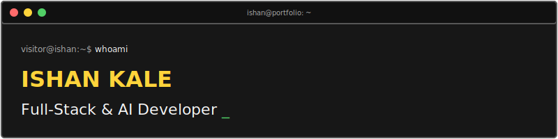

  

  
  

  <i>"I build full-stack web applications — from real-time chat systems to AI-powered tools — using Node.js, React, and MongoDB. Competitive programmer with 1600+ LeetCode rating. Always shipping something real."</i>

---

  

### 🛠️ Languages & Core

  
  
  
  
  
  

### ⚙️ Frameworks & Libraries

  
  
  
  
  
  

### 🎛️ Databases & Tools

  
  
  
  
  
  
  

---

  

* 🛒 **E-Commerce Platform**
  * *A robust, fully functional shopping platform.*
  * Stack: `React` `Node.js` `Express` `MongoDB`
  * Links: [GitHub](https://github.com/IshanKale/e-commerce) | [Live Demo](https://e-commerce-smoky-sigma.vercel.app/)
* 📝 **Resume Analyser**
  * *AI-powered resume feedback tool.*
  * Stack: `React` `Node.js` `Groq AI`
  * Links: [GitHub](https://github.com/IshanKale/resume-analyser)

---

  

* 🕵️ **Cyber Security Analyst (Virtual)** @ Deloitte Australia *[Jul 2025]*
  * Analysed web logs, investigated breaches, and verified threats.
* 📊 **Data Analytics Intern** @ Vodafone Idea Foundation *[Nov 2024]*
  * Applied AI models to improve data processing and analytical insights.
* 🎓 **Student Researcher** @ VIT Pune *[Mar 2026]*
  * Published a paper on AI-driven data science workflows and presented conference findings.
* 🌐 **Contributor** @ SSoC 2026 *[Jun-Aug 2026]*
  * Contributing to production open-source software architectures.

---

  

  
  

* 📄 **Paper Presentation: Keystroke Behaviour Analysis** @ ICEARS 2026 *(Feb 2026)*
* 🎓 **Full Stack Developer Certification** @ IBM *(Jun 2025)*
* 🛡️ **Cyber Security Training Certificate** @ Vodafone Idea Foundation *(Nov 2024)*
* 📊 **Data Visualization Certificate** @ Online Certification *(Aug 2024)*
* 🏆 **Hackathon Finalist** @ VIT Pune - *Created a custom visual parquet analysis tool.*
* 📈 **Competitive Programming** - *Top percentile rank across multiple coding contests.*

---

  

<table align="center" border="0" cellpadding="8" cellspacing="8">
  <tr>
    <td bgcolor="#171717" width="380" valign="top" style="border: 1px solid #575757;">
      

        <b>💻 GITHUB CARD</b> 
        

         
         
         
        
      

    </td>
    <td bgcolor="#171717" width="380" valign="top" style="border: 1px solid #575757;">
      

        <b>💡 LEETCODE CARD</b> 
        

         
         
         
        
      

    </td>
  </tr>
  <tr>
    <td bgcolor="#171717" width="380" valign="top" style="border: 1px solid #575757;">
      

        <b>🎯 CODEFORCES CARD</b> 
        

         
         
         
        
      

    </td>
    <td bgcolor="#171717" width="380" valign="top" style="border: 1px solid #575757;">
      

        <b>🍳 CODECHEF CARD</b> 
        

         
         
         
        
      

    </td>
  </tr>
</table>

---

  

  
  
  
  
  
  

